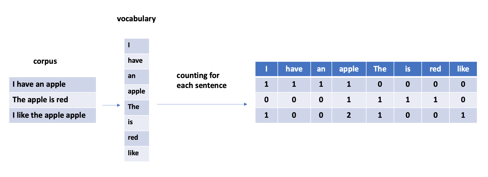

# Feature Extraction

Feature extraction is a crucial step in data processing, especially for textual data, to make it usable by machine
learning and deep learning algorithms. Below is a summary of the key points covered in the course on feature extraction
from raw text.

**Definition**: Feature extraction involves transforming complex data, such as text or images, into numerical features
that can be utilized by machine learning algorithms. Unlike feature selection, extraction focuses on converting raw
data into a usable format.

**Application**: Traditional machine learning algorithms cannot directly process raw text or images. This data must be
preprocessed to extract fixed numerical features. Deep learning techniques allow for end-to-end training (e.g., direct
processing of JPEG files by a neural network).

#### 🔢 **Feature Extraction with CountVectorizer**

CountVectorizer combines tokenization and counting occurrences in a single class, with
several useful parameters such as the removal of stop words, consideration of n-grams, and limiting term frequency.

<figure>
  
  <figcaption>How CountVectorizer works</figcaption>
</figure>

**Implementation**:

  ```python
  from sklearn.feature_extraction.text import CountVectorizer
  corpus = ["I have an apple.", "The apple is red", "I like the apple"]
  
  counterVec = CountVectorizer(stop_words='english')
  counterVec.fit(corpus)
  corpus_data = counterVec.transform(corpus)
  ```

To include both unigrams and bigrams in the extraction, use the `ngram_range=(1, 2)` parameter when
creating the CountVectorizer object.

  ```python
  counterVec = CountVectorizer(ngram_range=(1, 2))
  counterVec.fit(corpus)
  corpus_data = counterVec.transform(corpus)
  ```

#### 📊 **Difference between uni-gram, bi-gram, and n-gram**

- **Uni-gram**: A single word.
- **Bi-gram**: A pair of consecutive words.
- **N-gram**: A sequence of n words.

#### 📈 **Key Parameters of CountVectorizer**

- `stop_words`: Removes common words that do not carry much information (e.g., "the", "is", "and", common prepositions
  and so on).
- `ngram_range`: Specifies the range of n-values for different n-grams to be extracted.
- `min_df`: Ignores terms that have a document frequency lower than the given threshold.
- `max_df`: Ignores terms that have a document frequency higher than the given threshold.
- `strip_accents`: Removes accents and performs other character normalization.
- `lowercase`: Converts all characters to lowercase.
- `analyze` : The default value is `word`, but it can be set to `char` to extract character n-grams.

📌 **Another Extraction Method: TF-IDF**

- **TF-IDF**: Another important feature extraction method that weights words based on their frequency in the document
  and their rarity across the entire corpus, thus offering a richer representation of important words.