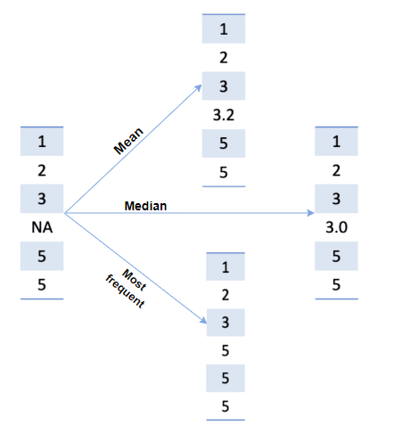

# Handling Missing Values

Missing values are common in real-world datasets for various reasons, including incomplete records or errors in data
collection. They can appear in different forms, such as `NaN`, `inf`, or other specific values. Sometimes, normal
values (like 0 or 1) are also considered missing in certain contexts. Missing values are problematic because:

- **Algorithm Compatibility:** Some algorithms or implementations cannot handle missing data and assume the dataset is
  complete.
- **Performance Impact:** Missing values can negatively affect the performance of models.

In many cases, the initial approach is to consider dropping rows or columns containing too many missing values. However,
this method can lead to the loss of valuable information.

## 🛠️ Simple Imputation

`SimpleImputer` offers simple strategies for imputing missing values:

- **Mean (`mean`):** Replace missing values with the mean of each column.
- **Median (`median`):** Use the median of each column.
- **Most Frequent (`most_frequent`):** Replace with the most frequent value in each column, usable for both numeric and
  categorical data.
- **Constant (`constant`):** Replace with a specified constant value.

<figure>
  
  <figcaption>Most common strategies of imputation</figcaption>
</figure>

**Implementation:**

```python
import numpy as np
from sklearn.impute import SimpleImputer

# Creating an example dataset with missing values
np.random.seed(42)
X = np.random.random(size=(4, 4))
X[2, 3] = np.nan
X[3, 0] = np.nan

# Imputation using the mean
imp_mean = SimpleImputer(strategy='mean')
X_mean = imp_mean.fit_transform(X)
```

**Result:**

```python
# The original value
[[0.37454012 0.95071431 0.73199394 0.59865848]
 [0.15601864 0.15599452 0.05808361 0.86617615]
 [0.60111501 0.70807258 0.02058449        nan]
 [       nan 0.21233911 0.18182497 0.18340451]]
 
# Fill the missing value by mean
[[0.37454012 0.95071431 0.73199394 0.59865848]
 [0.15601864 0.15599452 0.05808361 0.86617615]
 [0.60111501 0.70807258 0.02058449 0.54941305]
 [0.37722459 0.21233911 0.18182497 0.18340451]]
```

## 🛠️ Imputation with KNN

For a more advanced approach, `KNNImputer` allows for imputation using the k nearest neighbors. Each missing value is
replaced with the mean of the `n_neighbors` nearest neighbors found in the dataset.

```python
from sklearn.impute import KNNImputer

# Example usage with KNNImputer
X = np.array([[1, 2, np.nan, 2], [3, 4, 3, 5], [np.nan, 6, 5, 7], [8, 8, 7, 9]])
knn = KNNImputer(n_neighbors=3)
X_trans = knn.fit_transform(X)
```

**Result:**

```python
# The original value
[[ 1.  2. nan  2.]
 [ 3.  4.  3.  5.]
 [nan  6.  5.  7.]
 [ 8.  8.  7.  9.]]

# Fill the missing value is KNN
[[1. 2. 5. 2.]
 [3. 4. 3. 5.]
 [4. 6. 5. 7.]
```
